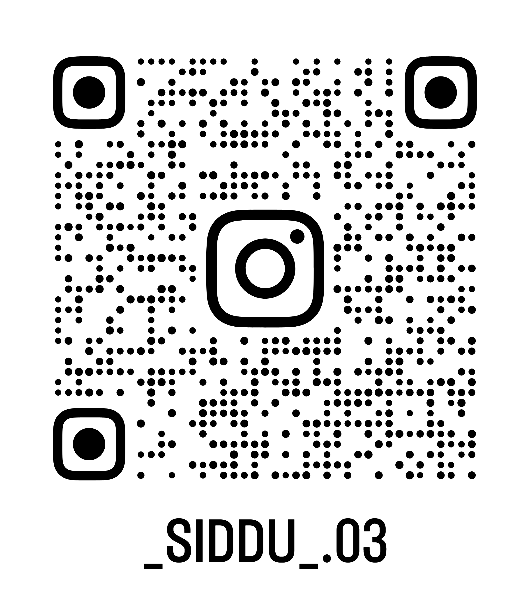

# Siddeshwarprasad K R

**Cybersecurity & AI Enthusiast | B.Tech CSE @ RV University**  

---

### 🧑‍💻 About Me

- 🎓 B.Tech (Hons) in Computer Science and Engineering  
- 🎓 Major: Cybersecurity | Minor: Business Administration  
- 💡 Interests: Cybersecurity, AI, Linux, System Security, Networking  

---

### 🛠 Technical Skills

| Language / Tool | Proficiency |
|-----------------|------------|
| C               | Intermediate |
| MySQL           | Advanced     |
| HTML/CSS        | Advanced     |
| JavaScript      | Intermediate |
| Python          | Beginner     |

**Tech Stack:**  

---

### 📊 GitHub Activity

  

---

### 🚀 Future Goals

- Contribute to open-source cybersecurity or AI projects  
- Build AI tools for automation and security research  
- Secure internships in cybersecurity, AI, or systems research

---

### 📫 Contact

- Email: **siddeshwarprasadkr@gmail.com**  
- LinkedIn: [Siddeshwarprasad K R](www.linkedin.com/in/siddeshwarprasadkr)  
- Portfolio: [In Progress](#)

---

**Instagram (on a closing note):**  

  

